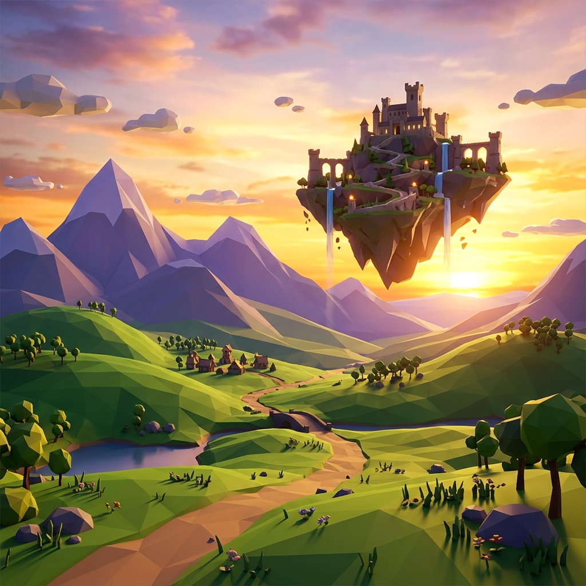

# Eldoria: The Lost Realm 🌲🐉

An immersive 3D survival RPG set in the mystical realm of Eldoria. Explore lush forests, survive ancient guardians, and witness the majesty of dragons in this high-fidelity browser experience.

---

### 🎮 [CLICK HERE TO PLAY IN YOUR BROWSER](https://victorvb18.github.io/Eldoria-Survival/)

---



## ✨ Features
*   🎬 **Cinematic Intro**: A movie-style storytelling sequence for all new characters.
*   🌍 **Procedural World**: Explore diverse biomes including Magic Forests, Golden Plains, and Crystal Highlands.
*   🏰 **Capital City**: Visit the grand city at the center of the world featuring a castle, blacksmith, and church.
*   🎭 **Advanced Character Creator**: Deep personalization for your adventurer:
    *   **360° Preview**: Click and drag to rotate your character for a full inspection.
    *   **Expression System**: Change your look with distinct eye styles (Serious, Angry, Undead, etc.).
    *   **Battle Scars**: Add procedural 3D scars to your face.
    *   **Epic Accessories**: Equip Royal Capes, Warrior Headbands, and Ninja Masks.
    *   **Tabbed Interface**: Organized categories for a seamless customization experience.
*   🎒 **RPG Inventory & Crafting**: A dual-view backpack system for managing loot and crafting survival gear.
*   📦 **Loot & Treasure**: Find hidden chests in Ruins and Crystal Caves containing essential equipment.
*   💾 **Persistent Saves**: 4 save slots that track your level, health, and unique appearance.
*   🌍 **Dynamic Open World**: Real-time lighting, atmospheric day/night cycles, and diverse biomes.

## 🎮 Controls
*   **WASD**: Movement
*   **SPACE**: Jump
*   **SHIFT**: Sprint
*   **MOUSE**: Look around
*   **LEFT CLICK**: Attack / Interact
*   **E**: Inventory / Crafting
*   **ESC**: Pause Menu

---

## 📥 How to Download & Play Locally
If you want to run the game on your own machine:

1.  **Download/Clone**: Click the green **"Code"** button at the top of this page and select **"Download ZIP"**, or run:
    ```bash
    git clone https://github.com/VictorVB18/Eldoria-Survival.git
    ```
2.  **Install dependencies**:
    ```bash
    npm install
    ```
3.  **Start the game**:
    ```bash
    npm run dev
    ```
4.  **Open in browser**: Visit `http://localhost:5173`.

---

## 🛠️ Built With
*   [Three.js](https://threejs.org/) - 3D Engine
*   [Vite](https://vitejs.dev/) - Frontend Tooling
*   [Simplex-Noise](https://github.com/jwagner/simplex-noise.js) - Procedural Generation Engine

---
*Created with ❤️ by Antigravity*
